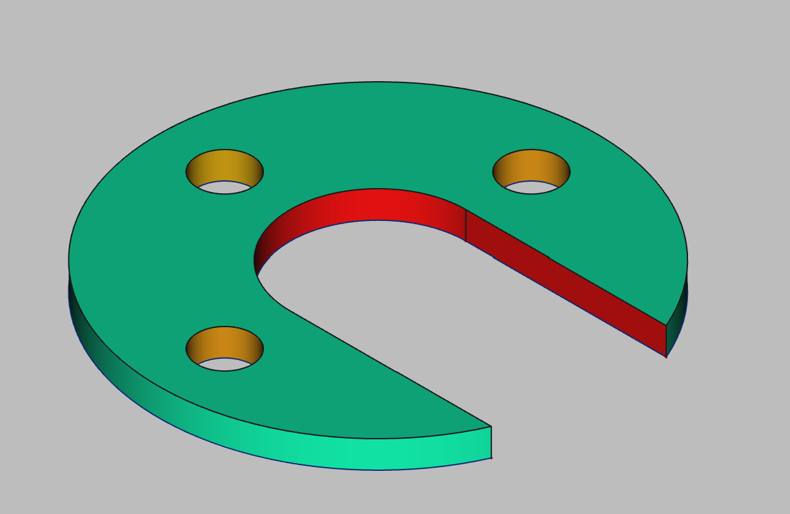

## 3D Printing Projects - Example 1
  
# Approach
Sketched large circle on the XY plane   
Sketched large circle in the center  
Extended a line from the top and botomm apex to the outer ring  
Trimmed the outer ring to form the opening  
Skteched three smaller circles on the same plane  
Padded out the closed object  
Punched out the three small three holes  
Created a mesh file for slicing  
  
# Alternate approaches
Could use a pocket to punch out a sketched rectangle  
  
# First principles skills I picked up
project files  
model view  
task view  
sketches drawing  
XY plane & axis's  
circles & arcs  
radial/dimensional constraints  
horizontal & vertical constraints  
mirroring constraint  
equality constraint  
trimming  
padding  
holes  
coloring  
meshing  
  
# Overall impression
Generally a single dimensional object with not complex shapes  

# File References
This notes file: README-ex01.md  
FreeCAD project file: Cardin360-ex01.FCStd  
Requirements book view: Cardin360-ex01.png  
FreeCAD project rendered output: Result-ex01.png      
  
## Built With
FreeCAD 0.19 - FreeCAD (https://www.freecad.org/downloads.php)   
  
## Author
Michael Galarneau - Five0ffour   
Last update: December 8, 2021 
  
## Output   
  