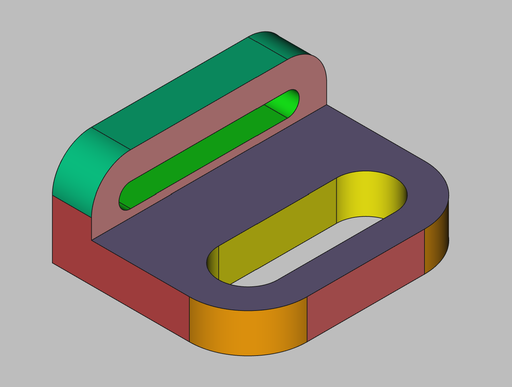

# 3D Printing Projects - Example 2
  
## Approach
Sketched out a base plate with an oval slot  
Padded it out  
Filleted the corner  
Sketched out a second rectange on the same plane offset on the z axes and added a slot  
Padded it out and filleted the corners  
Colored the model  
Created a slicer mesh   
  
## First principles skills I picked up
Oval slots  
Fillets  
Z-axis offsets  

## Overall impression
A simple two plane object with fillets. The garrish multi-color scheme matches the book!  

## Alternate approaches
Could have used a YZ plane for the second sketch  
  
## File References
This notes file: README-ex02.md  
FreeCAD project file: Cardin360-ex02.FCStd  
Requirements book view: Cardin360-ex02.png  
FreeCAD project rendered output: Result-ex02.png  
  
## Built With
FreeCAD 0.19 - FreeCAD (https://www.freecad.org/downloads.php)   
  
## Author
Michael Galarneau - Five0ffour 
Last update: December 8, 2021 
  
## Output   
  