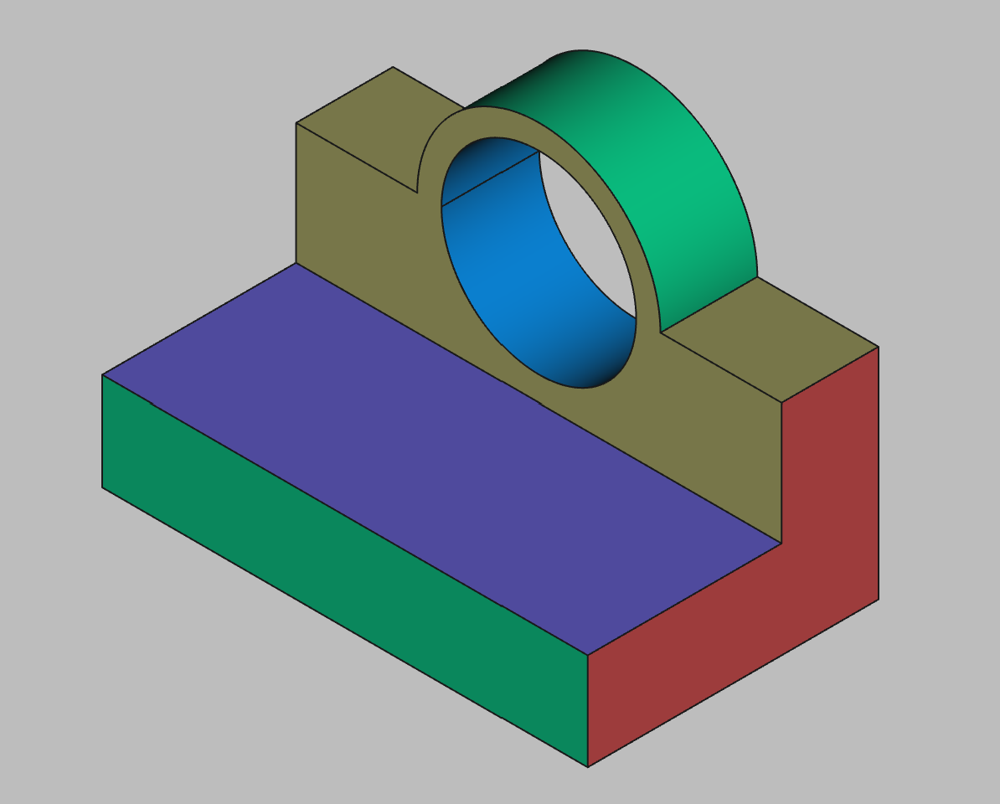

# 3D Printing Projects - Example 3
  
## Approach
Sketched out the rectangle base on XY axis  
Sketched out the backplane on the same plane offsetting the z position     
Sketched a circle onto the backplane and padded it out, trimmed out the interior
Added a second circle and holed it out  

## First principles skills I picked up
Holes  
Trimming  
  
## Overall impression
Similar to the previous example, it used a circle and hole approach instead of the oval slot  
  
## Alternate approaches
Again, need to get more comfortable  with YZ axis planes  

## File References
This notes file: README-ex03.md  
FreeCAD project file: Cardin360-ex03.FCStd  
Requirements book view: Cardin360-ex03.png  
FreeCAD project rendered output: Result-ex03.png  
  
## Built With
FreeCAD 0.19 - FreeCAD (https://www.freecad.org/downloads.php)   
  
## Author
Michael Galarneau - Five0ffour  
Last update: December 8, 2021  
    
## Output   
  