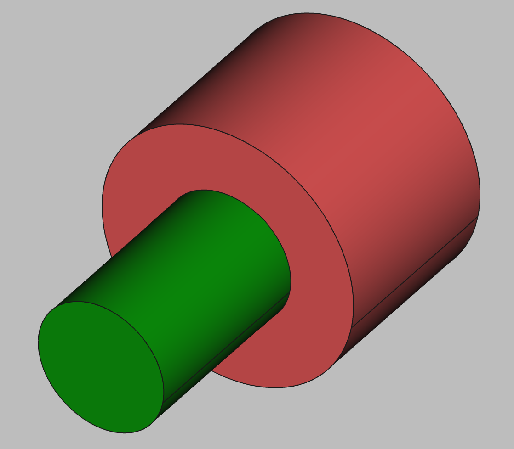

# 3D Printing Projects - Example 4
  
## Approach
Sketched out the basic circle  
Padded it out  
Created a second sketch of a smaller circle offsetting the z-axis  

## First principles skills I picked up
offsetting axis and planes     

## Overall impression  
Offsetting the z-axis is a way to stack objects, but otherwise seemed straightforward

## Alternate approaches
Note sure how the z-axis offsets affect the mesh, i need to investigate
Could have built this against the YZ plane versus XY and rotating.  But again, consider the mesh and printing impacts beforehand     

## File References
This notes file: README-ex04.md  
FreeCAD project file: Cardin360-ex04.FCStd  
Requirements book view: Cardin360-ex04.png  
FreeCAD project rendered output: Result-ex04.png  
  
## Built With
FreeCAD 0.19 - FreeCAD (https://www.freecad.org/downloads.php)   
  
## Author
Michael Galarneau - Five0ffour  
Last update: December 8, 2021  
    
## Output   
  