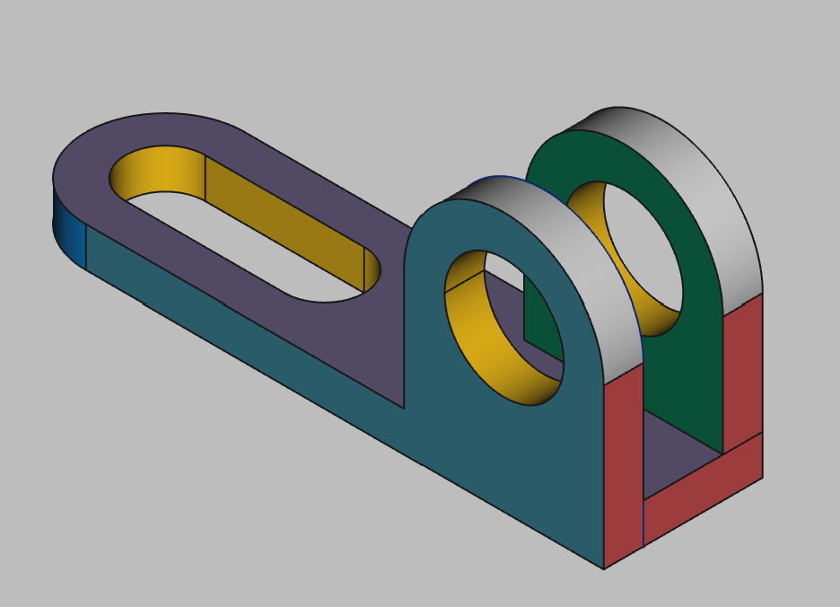

# 3D Printing Projects - Example 5
  
## Approach
Sketched the base plate on XY axis with a slot and padded out  
Created a spoke on the XZ axis, with a circle,  padded and added hole
Created an z-offset spoke on the XZ axis with another matching circle, padded and added hole
Colored  

## First principles skills I picked up  
combining multiple planar sketches  

## Overall impression  
This one was a bit tricky at first. Multiple layers on the same plane ortagonal to another. Use of the XY, XZ and z-axis offsets all came in handy here.

## Alternate approaches
I didn't create a mesh so I am not sure about printabiltiy here. I notice some inconsistent lines in the rendering.

## File References
This notes file: README-ex05.md  
FreeCAD project file: Cardin360-ex05.FCStd  
Requirements book view: Cardin360-ex05.png  
FreeCAD project rendered output: Result-ex05.png  
  
## Built With
FreeCAD 0.19 - FreeCAD (https://www.freecad.org/downloads.php)   
  
## Author
Michael Galarneau - Five0ffour  
Last update: December 8, 2021  
    
## Output   
  