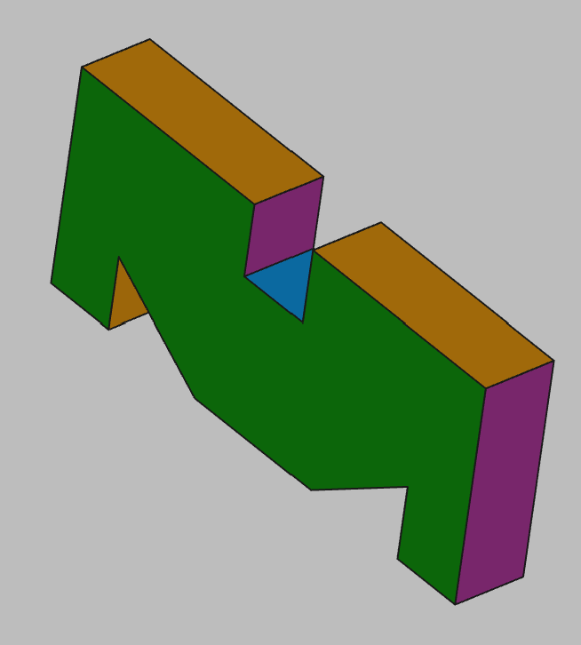

# 3D Printing Projects - Example 6
  
## Approach
Sketched on the XY plane and created a polygon object  
Adjusted constraints accordingly, mirroring where possible  
Padded and set the colors  

## First principles skills I picked up  
Polygon object and mirroring

## Overall impression  
Mostly a simple two-dimensional object, the polygon object made it quickly but I am not sure it is best approach from a maintenance perspective. Although the book example seems to show an XZ axis rendering, i kept it on XY for printing convenience as those triangles could give support issuess  

## Alternate approaches
Need to revist this one with mirrored objects and pocket cuts. I suspect it would cut the number of constants to maintain in half. Sketching on the XZ axis would yield less printing bed surface contact an a cleaner print. It may be a worthwhile tradeoff.  

## File References
This notes file: README-ex06.md  
FreeCAD project file: Cardin360-ex06.FCStd  
Requirements book view: Cardin360-ex06.png  
FreeCAD project rendered output: Result-ex06.png  
  
## Built With
FreeCAD 0.19 - FreeCAD (https://www.freecad.org/downloads.php)   
  
## Author
Michael Galarneau - Five0ffour  
Last update: December 8, 2021  
    
## Output   
  