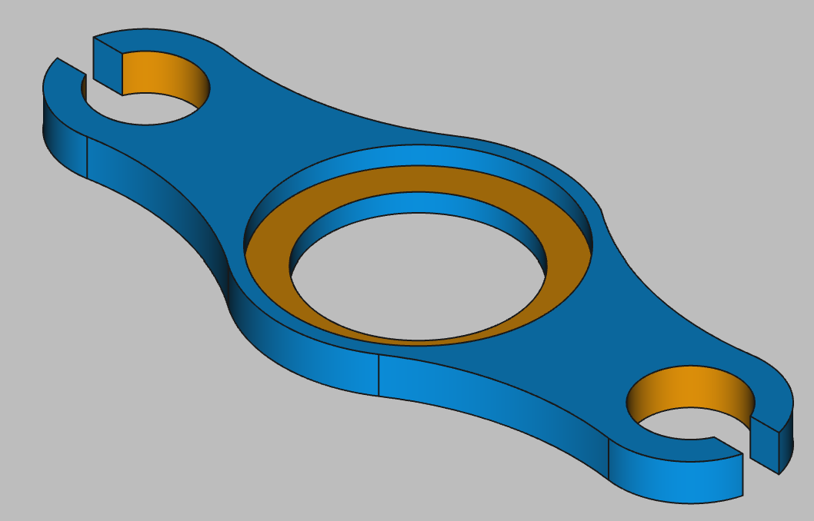

# 3D Printing Projects - Example 7
  
## Approach
Sketched two mirroed circles about the Y axis and added smaller diameter inner cirlces for holes   
Added a large circle in the center for the hole  
Added four outside circles tangential to each of the corners, touching both the center and one winged cirlce  
Trimmed the excess circle away leaving only one arch connecting the small circles to the large  
Trimmed internal lines to make one continuous object  
Sketched a larger circle about the center point and holed it out to a limited depth to make the countersink cut  
Set the colors

## First principles skills I picked up  
Tangent constraints!  (tangent & circles)    
Mirroring  

## Overall impression  
This one was tricky as I needed to reason out how the arced shape between the small and large holes were achieved.  
  
## Alternate approaches
Not sure, this one looks maintainable, unless an outline or spline can achieve the same effect    

## File References
This notes file: README-ex07.md  
FreeCAD project file: Cardin360-ex07.FCStd  
Requirements book view: Cardin360-ex07.png  
FreeCAD project rendered output: Result-ex07.png  
  
## Built With
FreeCAD 0.19 - FreeCAD (https://www.freecad.org/downloads.php)   
  
## Author
Michael Galarneau - Five0ffour  
Last update: December 8, 2021  
    
## Output   
  