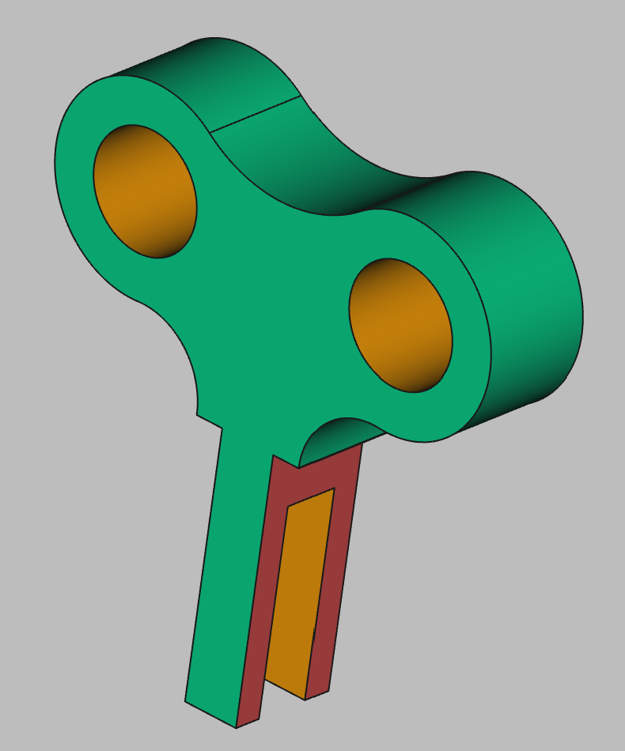

# 3D Printing Projects - Example 8
  
## Approach
Sketched two mirroed circles and smaller ones for holes   
Centered a rectangle about the y axis as the stem   
Added tangent circles on top and sides anchoring to the stem and each other  
Connected all points, trimmed the excess to make a key shape  
Padded it out 

## First principles skills I picked up  
Leveraging the sklils of the previous projects: tangents, mirrors, axies, pockets  

## Overall impression  
Good challenge so far, mastering the current known skills    

## Alternate approaches
to be determined    

## File References
This notes file: README-ex08.md  
FreeCAD project file: Cardin360-ex08.FCStd  
Requirements book view: Cardin360-ex08.png  
FreeCAD project rendered output: Result-ex08.png  
  
## Built With
FreeCAD 0.19 - FreeCAD (https://www.freecad.org/downloads.php)   
  
## Author
Michael Galarneau - Five0ffour  
Last update: December 8, 2021  
    
## Output   
  