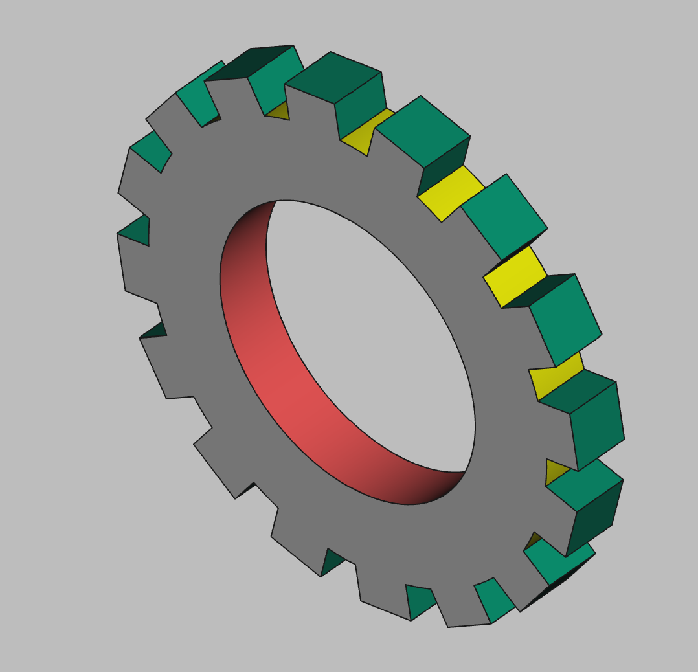

# 3D Printing Projects - Example 9
  
## Approach
Used Part Design to create an involute gear but couldn't get the involute gear to work as it seems to assume bevel gears. Next I googled and found a square tooth gear macro that someone created using arrays. It looks like it can do the job if I do my math correctly.  

## First principles skills I picked up  
Involute gear   
Macros  
Arrays  

## Overall impression  
A tough one in FreeCAD. The involute gear feature doesn't seem to support square teeth. I need to do it manually, but yikes.

## Alternate approaches

## File References
This notes file: README-ex09.md  
FreeCAD project file: Cardin360-ex09.FCStd  
Requirements book view: Cardin360-ex09.png  
FreeCAD project rendered output: Result-ex09.png  
  
## Built With
FreeCAD 0.19 - FreeCAD (https://www.freecad.org/downloads.php)   
  
## Author
Michael Galarneau - Five0ffour  
Last update: December 9, 2021  
    
## Output   
  