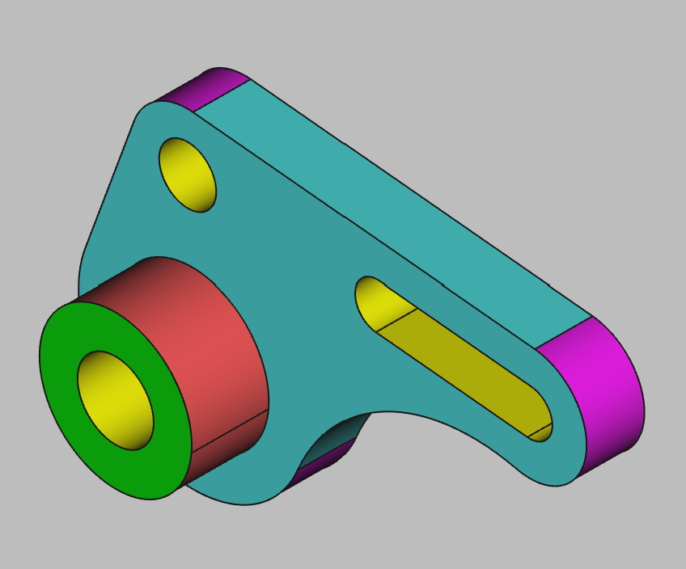

# 3D Printing Projects - Example 10
  
## Approach
Created the three large cirlces for the left, right and bottom  
Created a large construction cirlce as reference for the lower right side  
Connected the circles together through tangent functions  
Connected the left and top circles using tangent lines  
Trimmed the inner excess lines to make a solid geometry  
Added the oval and center cut base plate cirlces  
Padded it to a 3D shape  
Added a new sketch on the same plane offset by the base unit depth  
Added the next cirlce and smaller inner reference cirlce  
Padded it out on top of the base plate with the hole cut out  
Sketched out a final hole to ensure it was entirely through the base plate  
Set the colors  

## First principles skills I picked up  
Nothing that hasn't been seen in the previous exercises  
Arcs, tangents, trimming, planes, stacking, padding, holes  
Construction lines were helpful  

## Overall impression  
Uses reference circles and tangents for complex outlines  
Uses mutiple planes to stack objects on  
Uses multi-depth holes to ensure the parts are complete    

## Alternate approaches
Extrusion or chamfer cuts on a solid polygon may have worked instead of circles and arcs  

## File References
This notes file: README-ex10.md  
FreeCAD project file: Cardin360-ex10.FCStd  
Requirements book view: Cardin360-ex10.png  
FreeCAD project rendered output: Result-ex10.png  
  
## Built With
FreeCAD 0.19 - FreeCAD (https://www.freecad.org/downloads.php)   
  
## Author
Michael Galarneau - Five0ffour  
Last update: December 10, 2021  
    
## Output   
  