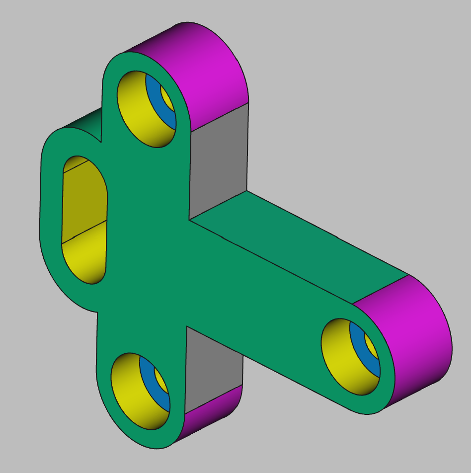

# 3D Printing Projects - Example 11
  
## Approach

## First principles skills I picked up  

## Overall impression   

## Alternate approaches

## File References
This notes file: README-ex11.md  
FreeCAD project file: Cardin360-ex11.FCStd  
Requirements book view: Cardin360-ex11.png  
FreeCAD project rendered output: Result-ex11.png  
  
## Built With
FreeCAD 0.19 - FreeCAD (https://www.freecad.org/downloads.php)   
  
## Author
Michael Galarneau - Five0ffour  
Last update: December 10, 2021  
    
## Output   
  