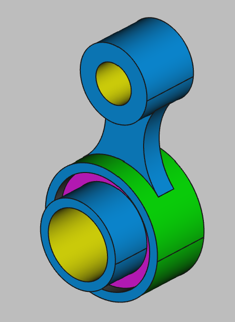

# 3D Printing Projects - Example 12
  
## Approach
Wasn't sure where to start  
Decided to first sketch the middle bean shaped plate shaped with tangent arcs. No need for the center punches yet  
After that I padded out the center spoke on an z-offset plane with the approriate rings starting from the widest and working in  
Once padded, and with sketch circles in place, I used a pocket cut to make the slotted holes on the big socket  
Repeated the same process with the smaller hub  
Colored and declared it done  

## First principles skills I picked up  
Circles, tangents, stacked planes, pad & cut  
Pads and pocket cuts with z-dimensional offsets and sketch guides    

## Overall impression   
This one truly has a front and back that is dimensionally async against an asymetric object. I see the step up in complexity here. FreeCAD did all the heavy lifting with this project.  Once the basic shape was layed out with the contour cuts (guiding circles, tangent, then trim), it was a matter of stacking sketches in the offset z-axis, adding circles and making the pads & pocket cuts.  Easy peasy  

## Alternate approaches
Perhaps I could combine some of the steps of these sketches, or start with a wide plate and pocket it down, not build it up as I did  

## File References
This notes file: README-ex12.md  
FreeCAD project file: Cardin360-ex12.FCStd  
Requirements book view: Cardin360-ex12.png  
FreeCAD project rendered output: Result-ex12.png  
  
## Built With
FreeCAD 0.19 - FreeCAD (https://www.freecad.org/downloads.php)   
  
## Author
Michael Galarneau - Five0ffour  
Last update: December 12, 2021  
    
## Output   
  