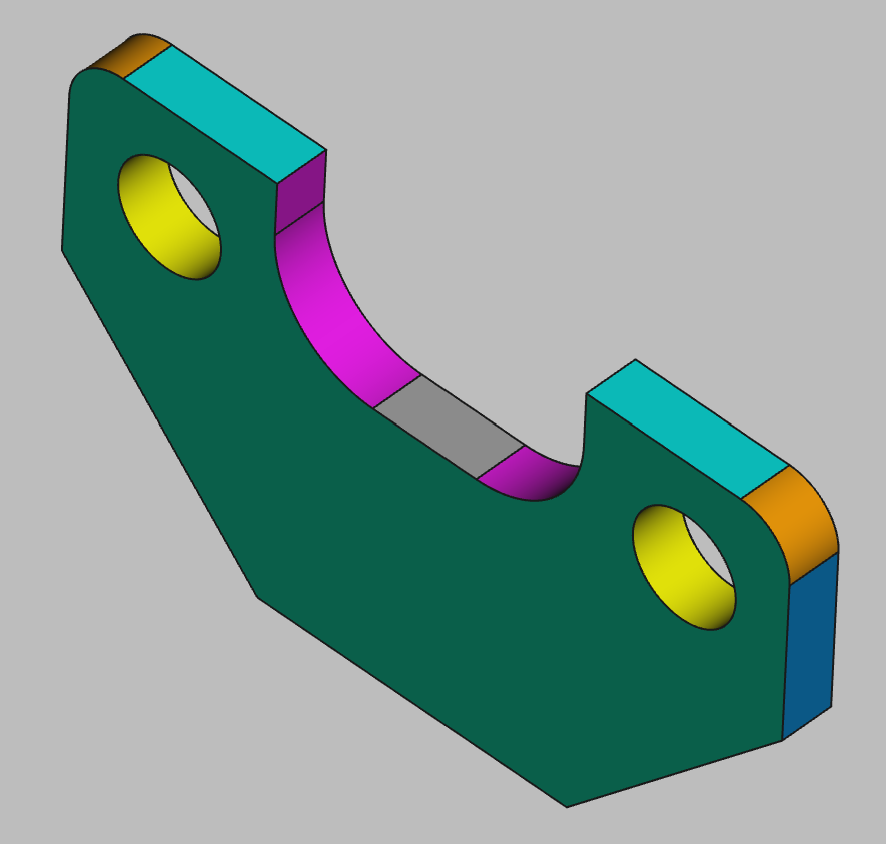

# 3D Printing Projects - Example 13
  
## Approach
Worked through this one manually  
Sketched the basic square shape to dimensional accuracy  
Lopped off the bottom corners using right triangles as a guides  
Added two circles, one to each corner  
Using all the elements as reference, added reference circles into the center of the plate  
Adding additional horizontal lines connecting them ad the bottom, and connecting the sides to the top, I trimmed out all the excess to make the U-shape  
After that I padded that basic plate shape to depth  
Added a dimensionally accurate fillet on the upper left corner  
Added another fillet on the upper right corner  
Set the colors  

## First principles skills I picked up  
Refernces circles, triangles, lines and arcs as guides  
Trimming out internals to make odd shapes  
Fillet where possible  
Pads create holes automatically when circles are in place  

## Overall impression   
Overall a fairly straight-forward polygon object one figures out how to make the correct reference points for the top middle U-cutout.  

## Alternate approaches
I attempted to do a U-shaped punchout after I filleted the base plate. FreeCAD would have none of that. I went back and added them to the base sketch first and padded it out as an irregularly shaped polygon.  From there, the fillets were added as the final flourish.  

## File References
This notes file: README-ex13.md  
FreeCAD project file: Cardin360-ex13.FCStd  
Requirements book view: Cardin360-ex13.png  
FreeCAD project rendered output: Result-ex13.png  
  
## Built With
FreeCAD 0.19 - FreeCAD (https://www.freecad.org/downloads.php)   
  
## Author
Michael Galarneau - Five0ffour  
Last update: December 12, 2021  
    
## Output   
  