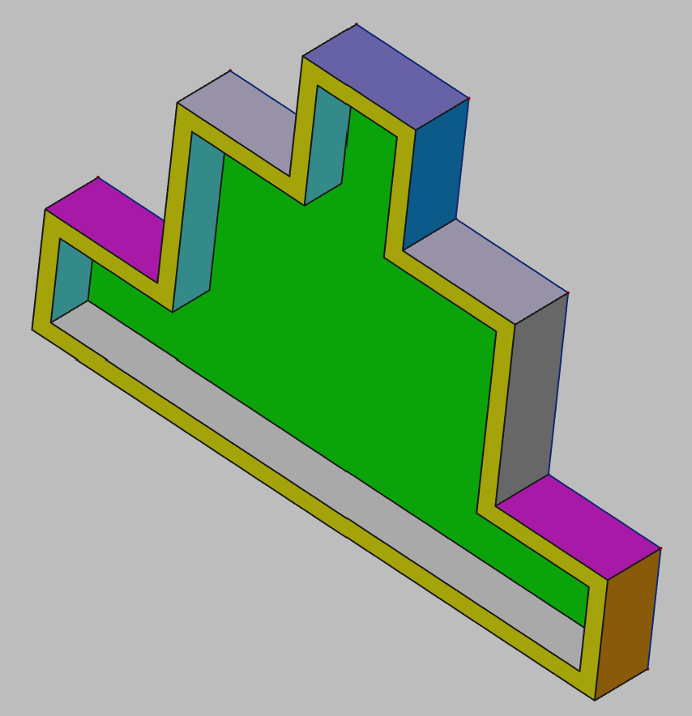

# 3D Printing Projects - Example 14
    
## Approach
Sketched out pyramid shaped base plate using the polygon tool and padded to z-depth  
Sketched out an inner polygon dimensionally smaller   
Used the pocket tool to cut that one out the dpeth (not through)  
Set the colors    

## First principles skills I picked up  
Polygon tool  
Padding
Pocket feature 
Horizontal, equality, vertical and symmetry contraints
  
## Overall impression   
This one is straightfoward based on the previous exercises.  A two dimensional objects and a quick pocket cut.    

## Alternate approaches
I need to look deeper at the automation around pocket cuts.  There might be a way to make an automatic inside cut if I created and exposed the proper reference lines.    
  
## File References
This notes file: README-ex14.md  
FreeCAD project file: Cardin360-ex14.FCStd  
Requirements book view: Cardin360-ex14.png  
FreeCAD project rendered output: Result-ex14.png  
  
## Built With
FreeCAD 0.19 - FreeCAD (https://www.freecad.org/downloads.php)   
  
## Author
Michael Galarneau - Five0ffour  
Last update: December 12, 2021  
    
## Output   
  