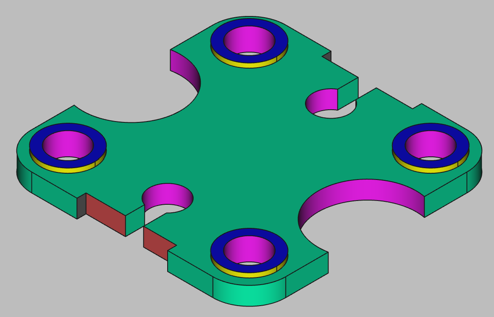

# 3D Printing Projects - Example 15
    
## Approach
Sketched the base plate to dimensional square shape  
Filleted the corners in the sketch  (watch out, need to reset the corner constraints!)  
Created symmetrical reference circles for the sides and trimmed them to arcs  
Padded the baseplate to size  
Added two symmetrical rectangles to the top and bottom of the plate and ran a pocket cut to make the notches   
Added two more vertical perpendicular rectangles to pocket out the slots on the top and bottom  
Sketched large circles to each of the corners and padded out the z-axis to the raised height  
Sketched in on a z-axis offset smaller inner circles to the corners and pocketed out the holes
Sketched in on a z-axis offset the smaller center circles on the vertical axis and pocketed out those holes
Painted colors to match book illustration  

## First principles skills I picked up  
Realized i could fillet the corners right in sketch mode, I missed that before  

## Overall impression   
Again, using the basic principles I am already exposed to, this one was nice and tidy. I learned to sketch each component separately and label them rather than trying to shove them all in one master sketch. I labelled each step for more readability. I used geometric constraints as much as possible (equality, symmetry) to cut down on the hard coding.   

## Alternate approaches
I need to learn how to carry over dimension sizes between sketches. I am re-using the same hardcoded values in mulitple sketches, I know that isn't the best practice    

## File References
This notes file: README-ex15.md  
FreeCAD project file: Cardin360-ex15.FCStd  
Requirements book view: Cardin360-ex15.png  
FreeCAD project rendered output: Result-ex15.png  
  
## Built With
FreeCAD 0.19 - FreeCAD (https://www.freecad.org/downloads.php)   
  
## Author
Michael Galarneau - Five0ffour  
Last update: December 13, 2021  
    
## Output   
  