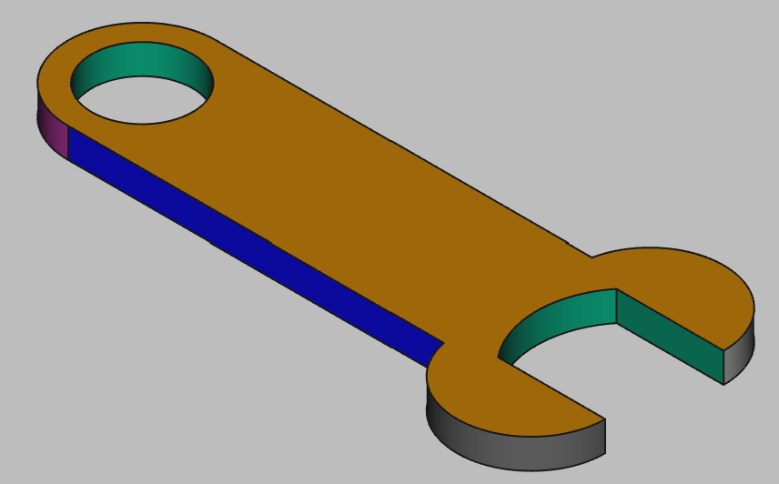

# 3D Printing Projects - Example 16
    
## Approach
Sketched out a vertical oval as a starting point  
Added in the center circle for the wrench head cut out  
Added horitonal lines for the teeth and trimmed to shape  
Added two circles and tangential horizontal lines for the handles  
Padded the shape out  
Set the colors  

## First principles skills I picked up  
Oval  
Circles  
Lines  
Tangents  
Pads  

## Overall impression   
Visually this one was a bit unusual as the oval shape isn't directly specified. Working in the handle only worked once the wrench head was fully formed. The oval required an extra line that had to be labelled a construction line as it couldn't be trimmed without a naming error.  

## Alternate approaches
Would break it up into two skethces, wrench head and handle  

## File References
This notes file: README-ex16.md  
FreeCAD project file: Cardin360-ex16.FCStd  
Requirements book view: Cardin360-ex16.png  
FreeCAD project rendered output: Result-ex16.png  
  
## Built With
FreeCAD 0.19 - FreeCAD (https://www.freecad.org/downloads.php)   
  
## Author
Michael Galarneau - Five0ffour  
Last update: December 14, 2021  
    
## Output   
  