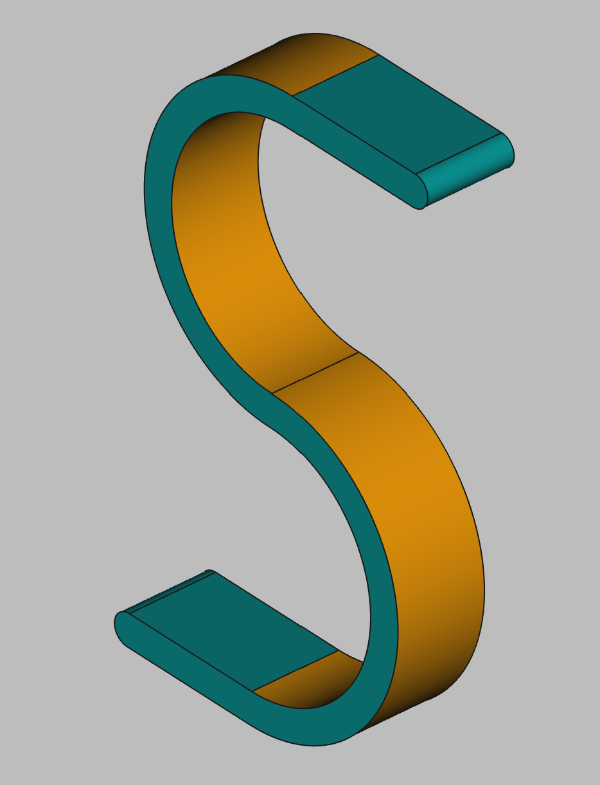

# 3D Printing Projects - Example 17
    
## Approach
Sketched using 6 arcs and four lines in symmetry:  inner arcs, outer arcs and the endcaps  
Layed out the top, dimensioned it and set the symmetry on the horizontal lines  
Layed out the bottom curves, used symmetry with the top arcs to close the object  
Padded and colored the sketch

## First principles skills I picked up  
Arcs - this was all about using the arc constraints  
Lines - for the tails  

## Overall impression   
This was an easy sketch, not challenges or surprises as it is mostly two dimensional  

## Alternate approaches
Maybe there-s a s-tool (splining?) that can do this faster  

## File References
This notes file: README-ex17.md  
FreeCAD project file: Cardin360-ex17.FCStd  
Requirements book view: Cardin360-ex17.png  
FreeCAD project rendered output: Result-ex17.png  
  
## Built With
FreeCAD 0.19 - FreeCAD (https://www.freecad.org/downloads.php)   
  
## Author
Michael Galarneau - Five0ffour  
Last update: December 14, 2021  
    
## Output   
  